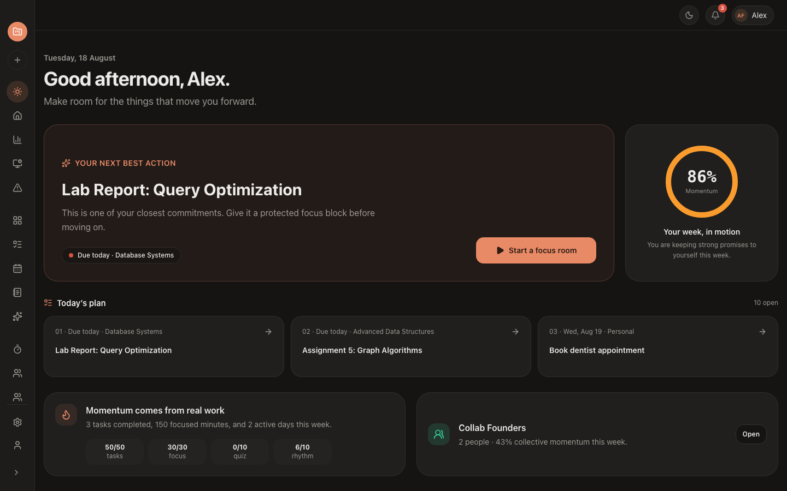
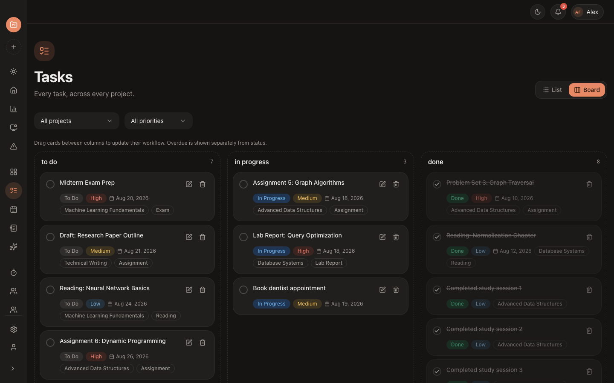
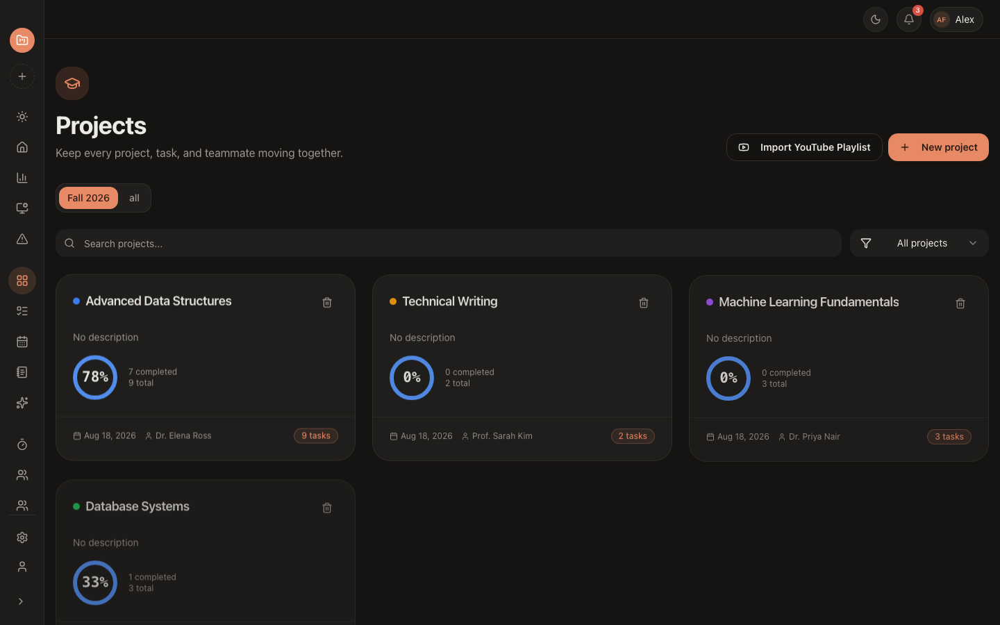
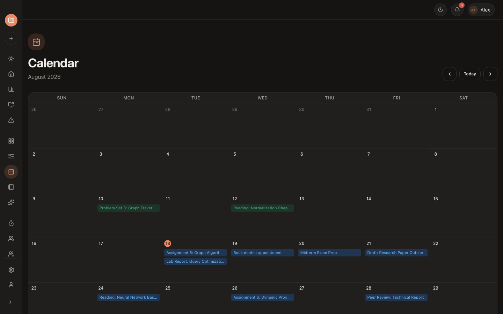
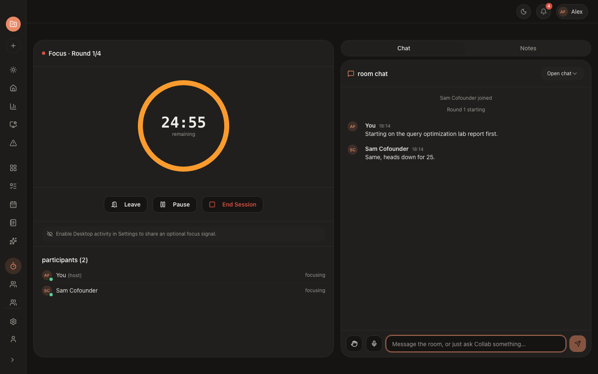
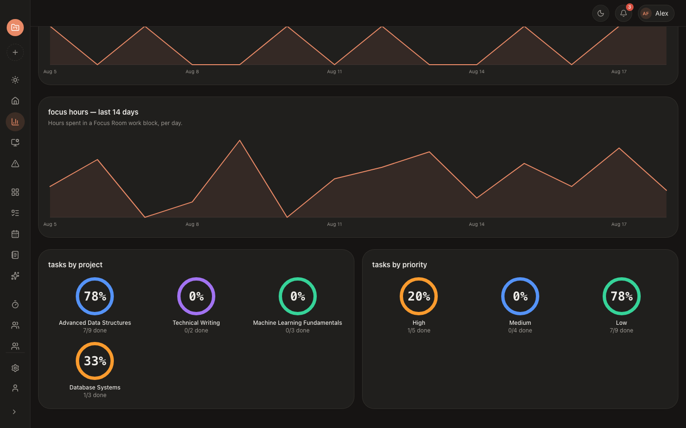
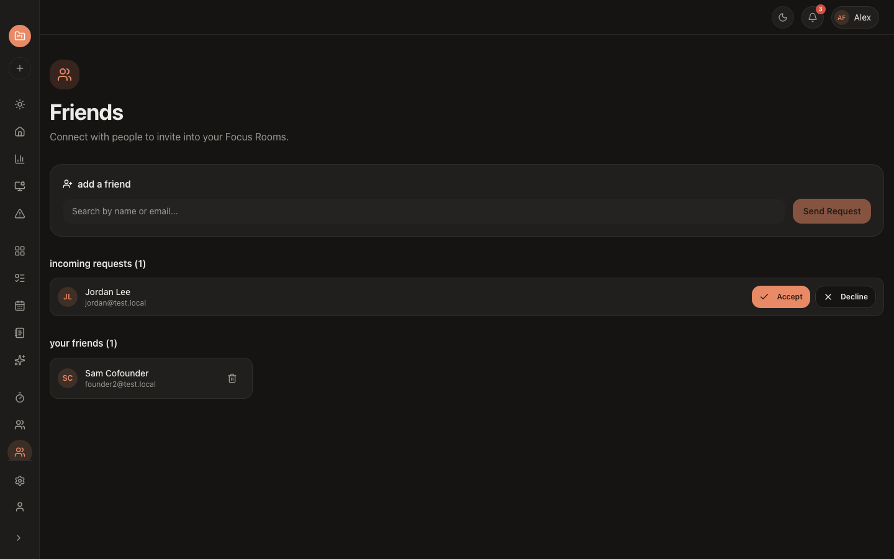
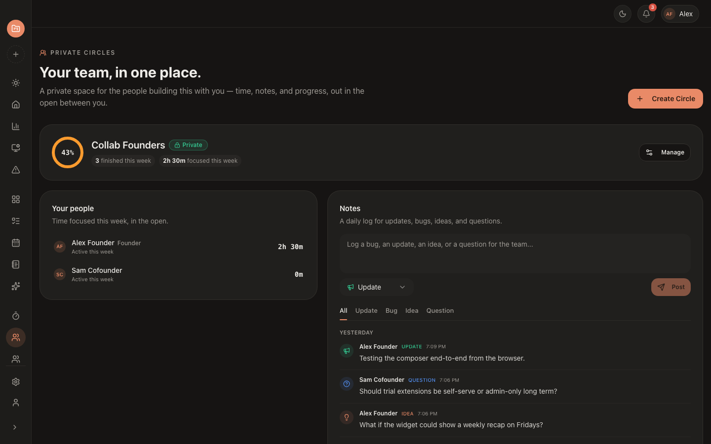
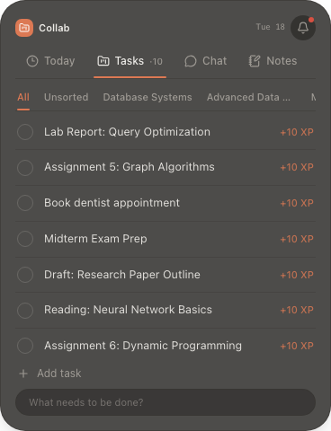

# Collab

**A full-stack coursework workspace** — courses, tasks, a calendar, and synchronized Pomodoro Focus Rooms with friends, all in one place.

Started as a generic project/task manager and evolved into a student-focused study tool: track courses and assignments, run Kanban boards per term, hold live co-working sessions with friends over WebSockets, and see it all summarized with real-time stats.

[](#)
[](#)
[](#)
[](#)
[](#)
[](LICENSE)

---

## Screenshots

<table>
  <tr>
    <td width="50%"><p align="center"><sub>Today — your next best action, at a glance</sub></p></td>
    <td width="50%"><p align="center"><sub>Tasks — drag-and-drop Kanban board</sub></p></td>
  </tr>
  <tr>
    <td width="50%"><p align="center"><sub>Projects — per-course progress rings</sub></p></td>
    <td width="50%"><p align="center"><sub>Calendar — every due date, one month at a time</sub></p></td>
  </tr>
  <tr>
    <td width="50%"><p align="center"><sub>Focus Rooms — live synchronized Pomodoro + chat</sub></p></td>
    <td width="50%"><p align="center"><sub>Stats — completion trends, focus hours, per-course rings</sub></p></td>
  </tr>
  <tr>
    <td width="50%"><p align="center"><sub>Friends — send/accept requests, invite into rooms</sub></p></td>
    <td width="50%"><p align="center"><sub>Circles — a private team space with shared time and a daily notes log</sub></p></td>
  </tr>
</table>

**Desktop app** — the same account, packaged as a native macOS menu-bar companion (Tauri). A persistent widget follows you outside the browser: a compact focus timer when a Pomodoro session is running, and an expandable panel for tasks, Focus Room chat, and quick notes without switching windows.

<p align="center"><br/><sub>Desktop widget — tasks, chat, and notes in a menu-bar panel</sub></p>

The landing page also ships its own animated product tour (`components/landing/ScreensShowcase.jsx`) built from the same design tokens and components as the real app, auto-cycling through the screens above.

---

## Tech Stack

| Layer | Technologies |
| --- | --- |
| **Frontend** | React 19, Vite 7, React Router 7, Tailwind CSS, shadcn/ui (Radix primitives), Axios, date-fns, hand-built SVG charts (no charting library), `@stomp/stompjs` |
| **Backend** | Java 17, Spring Boot 3.2, Spring Web, Spring Data JPA (Hibernate), Spring Security, Spring Validation, Spring WebSocket (STOMP), Spring Boot Actuator |
| **Auth** | JWT (`jjwt`) bearer tokens, BCrypt password hashing, stateless sessions |
| **Real-time** | STOMP over WebSocket — one broker for synchronized Focus Room sessions (server-authoritative Pomodoro phases, chat, hand-raise) and one for push notifications |
| **Database** | PostgreSQL 15 (H2 in-memory for the test profile) |
| **Testing** | JUnit 5, Mockito, Spring Security Test, JaCoCo (line-coverage gate enforced per package in the Maven build) |
| **DevOps** | Docker (multi-stage builds, non-root runtime user, health checks), Docker Compose, Render (backend), Netlify (frontend) |
| **Other** | Jsoup (server-side article text extraction for Notes), Lombok |

---

## Features

**Courses & Tasks**
- Courses grouped by term, each with its own progress ring
- Tasks with priority, type, due date, and course tagging
- List view or a full drag-and-drop Kanban board (To Do / Overdue / Done, overdue computed from due date)
- Calendar view of every due date across all courses

**Focus Rooms**
- Create a room with a shareable join code, or invite friends directly
- Optionally schedule a room for later
- Server-authoritative synchronized Pomodoro timer (work / break / long break phases) shared by every participant
- Live in-room chat, locked to reactions during a focus block; hand-raise signal
- Rematch a completed room to start a fresh session with the same group

**Friends & Notifications**
- Send, accept, or decline friend requests
- Real-time in-app notifications over a dedicated WebSocket connection (friend requests, room invites) with a bell dropdown and unread count

**Notes**
- Save a note directly, or paste an article URL and have its readable text fetched and stored server-side (Jsoup) so it's available inside the app, not just an outbound link

**Stats & Profile**
- Completion trends and daily focus-hours trend (last 14 days), per-course completion rings, priority breakdown
- Editable profile with a real avatar upload (validated, stored on disk, served statically — no third-party storage dependency)
- Full dark/light theme support

---

## Architecture

```text
projectii-desktop/
├── backendProjecty/          # Spring Boot 3.2 API (Java 17)
│   ├── config/                # Security, CORS, WebSocket/STOMP, scheduling, static file serving
│   ├── controller/            # REST + STOMP message-mapped controllers
│   ├── dtos/                  # Request/response DTOs
│   ├── entity/                # JPA entities (User, Course, Term, Task, Note, FocusRoom, FriendRequest, Notification, ...)
│   ├── mapper/                # Entity <-> DTO mapping
│   ├── repository/            # Spring Data JPA repositories
│   ├── security/               # JWT filter, STOMP auth interceptor, current-user resolution
│   └── service/                 # Business logic
│
├── frontendProjecty/          # React 19 + Vite SPA — same web app, also the Tauri UI layer
│   ├── src/
│   │   ├── components/         # UI, grouped by feature (tasks, courses, focus-rooms, notes, notifications, landing, ...)
│   │   ├── pages/               # Route-level pages, including WidgetPage.jsx (see below)
│   │   ├── hooks/                # useAuth, useFocusRoomSocket, useNotificationSocket, useVoiceRecorder, ...
│   │   ├── services/             # Axios API clients, one per resource
│   │   └── context/               # Auth + activity-tracking context
│   │
│   └── src-tauri/               # Tauri v2 desktop shell (Rust) — wraps the same React app as a native macOS app
│       ├── src/
│       │   ├── main.rs           # Entry point
│       │   └── lib.rs            # Window management: main window, tray icon/menu, the always-on-top widget window,
│       │                          #   global shortcuts, native notifications, Tauri <-> webview event bridge
│       ├── capabilities/         # Tauri IPC permission manifest
│       ├── icons/                 # App + tray icon assets
│       └── tauri.conf.json        # Window definitions (main + widget), bundle/DMG config
│
├── docker-compose.yml          # Postgres + backend + frontend, for local all-in-one runs
├── render.yaml                  # Render Blueprint for the backend (Docker web service)
└── netlify.toml                  # Netlify build config for the web frontend (SPA redirects)
```

**Real-time design:** two independent STOMP connections rather than one shared client. Focus Rooms use a per-room connection where the server owns all state (phase timing, round count, chat) and broadcasts the full room snapshot on every change — the client never computes timer state itself beyond a local countdown display. Notifications use a second, session-wide connection subscribed to a per-user queue, so they arrive on any page, not just inside a room.

**Desktop app & widget:** the same React SPA runs inside a Tauri v2 shell for macOS, adding a persistent menu-bar tray and a small always-on-top widget window (`pages/WidgetPage.jsx`) alongside the full main window — each is its own independent webview running the same app bundle, not a shared JS runtime. Focus Room session state and chat are kept in sync between the two via Tauri events emitted from the main window's STOMP connection (`session-update`, `session-messages`), so the widget never opens a second WebSocket. Activity tracking is the exception: each window independently calls a native `frontmost_app` Tauri command to read the current foreground app and its icon straight from the OS, without going through the backend at all. The widget surfaces:
- **Today** — daily focus time, most-used app, and an "Ask Collab" command bar
- **Tasks** — quick add/complete without opening the main window
- **Chat** — the active Focus Room's live chat, bridged in from the main window's STOMP connection
- **Notes** — voice or text quick-capture, saved straight to the backend

A compact pill mode collapses the widget to just the running Pomodoro timer with pause/expand controls when a Focus Room session is active.

---

## Getting Started

### Option A — Docker Compose (recommended)

```bash
git clone https://github.com/omarignammas/Projectii.git
cd Projectii
cp .env.example .env   # then fill in real values
docker-compose up -d --build
```

- Frontend: http://localhost:3000
- Backend: http://localhost:8080
- Postgres: localhost:5432 (persisted in the `postgres-data` volume)

### Option B — Run manually

**Backend** (needs a local PostgreSQL database named in `application.properties`, or override via env vars — see below):

```bash
cd backendProjecty
./mvnw spring-boot:run
```

**Frontend:**

```bash
cd frontendProjecty
npm install
npm run dev
```

### Configuration

Everything is overridable via environment variables, with sensible local defaults baked in so the app runs out of the box without any `.env` file. See `.env.example` (Docker Compose) and `frontendProjecty/.env.example` (Vite):

| Variable | Used by | Default |
| --- | --- | --- |
| `SPRING_DATASOURCE_URL` / `_USERNAME` / `_PASSWORD` | Backend | Local Postgres on `localhost:5432` |
| `JWT_SECRET_KEY` / `JWT_EXPIRATION` | Backend | A dev-only key checked into `application.properties` — **override this in any real deployment** |
| `APP_CORS_ALLOWED_ORIGINS` | Backend | `http://localhost:3000` — comma-separated for multiple origins |
| `APP_UPLOADS_DIR` | Backend | `uploads` (avatar storage location) |
| `VITE_API_URL` | Frontend | `http://localhost:8080` |

---

## Testing

Backend: 120 JUnit 5 + Mockito tests (services and controllers), run with:

```bash
cd backendProjecty
./mvnw test
```

The Maven build fails if JaCoCo measures under 70% line coverage in any package (`jacoco-maven-plugin`, `check` goal) — a real, enforced gate, not just a report.

Frontend: ESLint (`npm run lint`) and a production build (`npm run build`) as a smoke check; no component test suite yet.

---

## Deployment

The backend deploys to **Render** as a Docker web service; the frontend deploys to **Netlify** as a static build. They're independent services that talk to each other over `VITE_API_URL` / `APP_CORS_ALLOWED_ORIGINS`.

### Backend → Render

1. Push this repo to GitHub (already done if you're reading this on GitHub).
2. In Render: **New → Blueprint**, point it at this repo — it picks up [`render.yaml`](render.yaml) and creates the `projectii-backend` Docker web service.
   - No blueprint? Create it manually instead: **New → Web Service**, runtime **Docker**, Dockerfile path `backendProjecty/Dockerfile`, Docker context `backendProjecty`.
3. Create a Postgres instance (Render Postgres, or any managed Postgres — Neon and Supabase both work).
4. Set these environment variables on the web service:
   - `SPRING_DATASOURCE_URL` — `jdbc:postgresql://<host>:<port>/<database>`
   - `SPRING_DATASOURCE_USERNAME`, `SPRING_DATASOURCE_PASSWORD`
   - `JWT_SECRET_KEY` — the blueprint auto-generates one; set your own if deploying manually
   - `APP_CORS_ALLOWED_ORIGINS` — your Netlify URL, e.g. `https://projectii.netlify.app`
5. Health check path is `/actuator/health` (already wired into `render.yaml` and the Dockerfile's `HEALTHCHECK`).

> Render's free plan has no persistent disk, so uploaded avatars won't survive a restart/redeploy. Fine for a demo; for real persistence, mount a paid disk or move avatar storage to S3-compatible object storage.

### Frontend → Netlify

1. In Netlify: **Add new site → Import an existing project**, pick this repo — it picks up [`netlify.toml`](netlify.toml) (base directory `frontendProjecty`, build command `npm run build`, publish directory `dist`, SPA redirect to `index.html`).
2. Site settings → Environment variables: set `VITE_API_URL` to the Render backend URL from above.
3. Deploy. Once you have the Netlify URL, go back to Render and set `APP_CORS_ALLOWED_ORIGINS` to it (they reference each other, so the backend needs to be told about the frontend's final URL).

---

## API Overview

Global prefix: `/api/v1`. All routes except `/auth/**` and `GET /uploads/**` require a `Authorization: Bearer <token>` header.

| Resource | Base path |
| --- | --- |
| Auth | `/auth` — register, login |
| Users | `/users/me` — profile read/update, avatar upload |
| Terms & Courses | `/terms`, `/courses` |
| Tasks | `/tasks` |
| Notes | `/notes` |
| Focus Rooms | `/focus-rooms` — create, join, invite, rematch (live session runs over STOMP, not REST) |
| Friends | `/friends`, `/friends/requests` |
| Notifications | `/notifications` |

---

## License

MIT — see [LICENSE](LICENSE).
